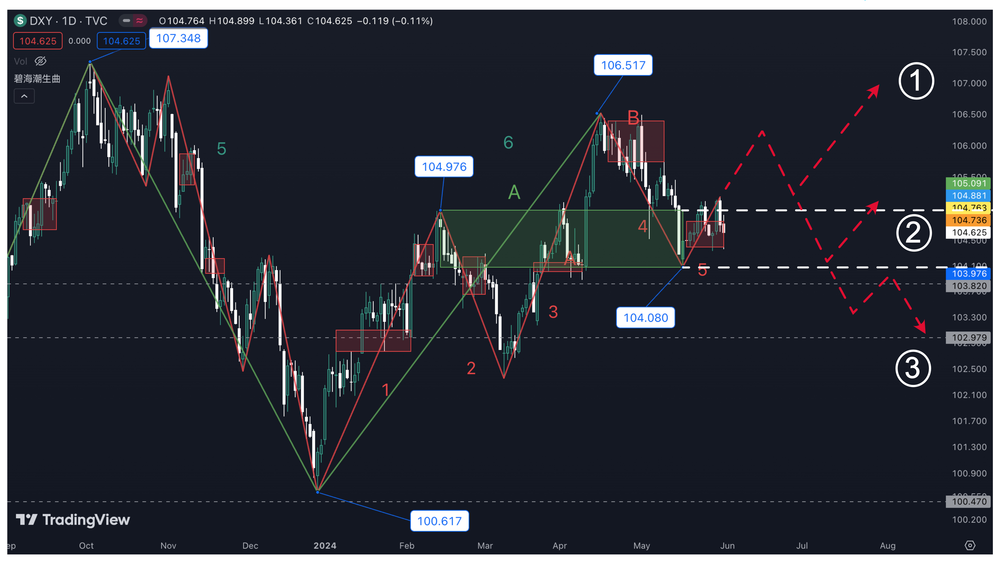

https://github.github.com/gfm/ 这是GH喜欢的格式

# 大标题 大小有6个级别的标题
## 中标题
### 字体变化

**加粗字体**， *斜字体*， ***加粗斜字体***， ~~化掉字体~~

### 列表

1. 有序列表1
2. 有序列表2
3. 有序列表3

- 无序列表1
- 无序列表2
- 无序列表3

1. 列表1
    - 列表嵌套1
    - 列表嵌套2
2. 列表2
3. 列表3

- [x] ~~完成的任务1~~
- [x] ~~完成的任务2~~
- [ ] 未完成的任务1
- [ ] 未完成的任务2

### 代码

`<p>This is the first item</p>`

`python3 -m install numpy`

```
{
  "firstName": "John",
  "lastName": "Smith",
  "age": 25
}
```

### 链接
#### 第一种方法（可以正确显示）
[文字链接1](http://olim.ca)

#### 第一种方法（不可以正确显示）
[文字链接]: http://google.com

#### 第一种方法（不可以正确显示）
[文字链接2-谷歌][文字链接]

图片链接和文字链接不同的是前面有个感叹号。可以加鼠标移动到图片时显示的文字。


[图片链接]: http://money.olim.ca/assets/images/2024/2024-05-31-DXY-fl.jpg "hover me"
![12345][图片链接]

上面两张图片在VS code预览不能正确显示（因为用了外部网址链接的方式？），在GH page上能正确显示。

下面图片在GH page不能正确显示，在VS code预览能正确显示（这里用了文件的相对路径的时候/前面多了两个点）


> 疑问：如何限制图片显示的尺寸？

下面是用HTML的picture格式来规定图片的显示：

<picture>
  <source media="(prefers-color-scheme: dark)" srcset="https://user-images.githubusercontent.com/25423296/163456776-7f95b81a-f1ed-45f7-b7ab-8fa810d529fa.png">
  <source media="(prefers-color-scheme: light)" srcset="https://user-images.githubusercontent.com/25423296/163456779-a8556205-d0a5-45e2-ac17-42d089e3c3f8.png">
  
</picture>

<picture>
  <source media="(prefers-color-scheme: dark)" srcset="https://omoney.olim.ca/assets/images/2024/2024-05-31-DXY-fl.jpg">
  <source media="(prefers-color-scheme: light)" srcset="https://omoney.olim.ca/assets/images/2024/2024-05-31-DXY-fl.jpg">
  
</picture>

### 引用 用>符号

> 这是引用的内容。
> 1. 引用内容里包括的列表1
> 2. 引用内容里包括的列表2

### 表格的制作
| Syntax Expression | Long Description | Other Notes Included |
|:-----------|:-----------:|-----------:|
| Header | Title | Items |
| Paragraph | Text | Note |

上面这表格在vs code里预览能正确显示。在github page上不能正确显示。

| Rank | THING-TO-RANK | 第三栏目居中 |
|-----:|:--------------|:-----------|
|     1|     靠左边     | 一段居中排列的话1 |
|     2|     第二个     | 一段居中排列的话2 |
|     3|     第三个     | 一段居中排列的话3 |

表格老是会出现这样或那样的问题。！

### 水平线制作 用三个“-”"*""_"符号都可以

第一种水平线(三个破折号，***建议使用***)

---

第二种水平线（三个星号，有时候有问题。我这里用了6ge星号）

******

第三种水平线（三个下划线，有时候有问题。我这里用了6个下划线）
______

### 脚注 （不正确显示）
这句话包括一个脚注明。[^1]
[^1]: 第一个脚注。

下面是我从GH里copy来的一段：
Here is a simple footnote[^1].

A footnote can also have multiple lines[^2].

[^1]: My reference.
[^2]: To add line breaks within a footnote, prefix new lines with 2 spaces.
  This is a second line.


### 几种警告的格式：

> [!NOTE]
> Useful information that users should know, even when skimming content.

> [!TIP]
> Helpful advice for doing things better or more easily.

> [!IMPORTANT]
> Key information users need to know to achieve their goal.

> [!WARNING]
> Urgent info that needs immediate user attention to avoid problems.

> [!CAUTION]
> Advises about risks or negative outcomes of certain actions.

### 路径图

Here is a simple flow chart:


### 高亮选择的段落 （检查是否正确显示）
1. 用“==”在所选段落的前后 （这种方法在github不工作）
2. 用<mark></mark>语言 （这个可以）

I need to highlight these ==very important words==.
我需要高亮==这段重要的话。==

我需要<mark>高亮这几个字</mark>。

### 点击展开更多内容：

<details>
<summary>My top languages</summary>

| Rank | Languages |
|-----:|-----------|
|     1| JavaScript|
|     2| Python    |
|     3| SQL       |

</details>

### 几种底色形式的notice

<div class="notice--info">
  <p>这是information类的notice</p>
</div>

<div class="notice--danger">
  <p>这是danger类的notice</p>
</div>

### 用HTML代码
```
<h1>This is a heading</h1>
<p>Paragraph...</p>

<hr />


<a href="https://github.com/im-luka">Follow me on GitHub</a>

<br />
<br />

<p>Quick hack for <strong><em>centering image</em></strong>?</p>
<p align="center"></p>

<details>
  <summary>One more quick hack? 🎭</summary>
  
  → Easy  
  → And simple
</details>
``` 

### 显示颜色代码的三种方式：
hex，rgb， hsl

The background color is `#ffffff` for light mode and `rgb(9, 105, 218)` for blue and `hsl(212, 92%, 45%)`for  blue mode again.

### 其它
$H_2$ O, $X^2$, $Y^3$

$`H_2`$ O; $`3^4`$; （看看这种方法是否可行）

只有下面这种方式可以正确显示：(用sub sup)
5<sup>2</sup>; H<sub>2</sub>O

下面的全部在github page上不能正确显示但在vs code预览里面正确显示。（我把`$`符号前后加了一个\`符号，看看效果）

$`\alpha`$ 

$\alpha$ $\beta$ $\delta$ $\gamma$ $\epsilon$ $\zeta$ $\eta$ $\theta$ $\iota$ $\kappa$ $\lambda$ $\mu$ $\nu$ $\xi$ $\pi$ $\rho$ $\sigma$ $\tau$ $\upsilon$ $\phi$ $\chi$ $\psi$ $\omega$

$\infty$; $+\infty$; $-\infty$

$\frac{3+8a}{5b+6}$

$\sum{3x^n}$

$\sum_{n=1}^N{3x^n}$

$\prod{3x^n}$

$\prod_{n=1}^N{3x^n}$

$\sqrt[5]{100}$

$\int^5_1{f(x)}{\rm d}x$

$\iint^5_1{f(x)}{\rm d}x$

$\iiint^5_1{f(x)}{\rm d}x$

$\lim_{n\rightarrow+\infty} n$

$\geq$; $\leq$; $\subset$; $\supset$; $\in$; $\pm$; $\cdot$ $\times$ $\div$ $\not=$ $\not<$ $\not\supset$ $\log$ $\ln$ $\bot$ $\angle$ $30^\circ$ $\sin$ $\cos$ $\tan$ $\leftarrow$ $\rightarrow$ $\uparrow$ $\downarrow$ $\longrightarrow$ 

$\log_2{18}$ 

$
  \begin{matrix}
   1 & 2 & 3 \\\
   4 & 5 & 6 \\\
   7 & 8 & 9
  \end{matrix}
$

$
 \begin{Bmatrix}
   1 & 2 & 3 \\\
   4 & 5 & 6 \\\
   7 & 8 & 9
  \end{Bmatrix}
$

$
 \begin{bmatrix}
   1 & 2 & 3 \\\
   4 & 5 & 6 \\\
   7 & 8 & 9
  \end{bmatrix}
$

$
\left[
\begin{matrix}
 1      & 2      & \cdots & 4      \\\
 7      & 6      & \cdots & 5      \\\
 \vdots & \vdots & \ddots & \vdots \\\
 8      & 9      & \cdots & 0      \\\
\end{matrix}
\right]
$

$\begin{bmatrix}
{a_{11}}&{a_{12}}&{\cdots}&{a_{1n}}\\\
{a_{21}}&{a_{22}}&{\cdots}&{a_{2n}}\\\
{\vdots}&{\vdots}&{\ddots}&{\vdots}\\\
{a_{m1}}&{a_{m2}}&{\cdots}&{a_{mn}}\\\
\end{bmatrix}$

$\begin{cases}
a_1x+b_1y+c_1z=d_1\\\
a_2x+b_2y+c_2z=d_2\\\
a_3x+b_3y+c_3z=d_3\\\
\end{cases}
$


